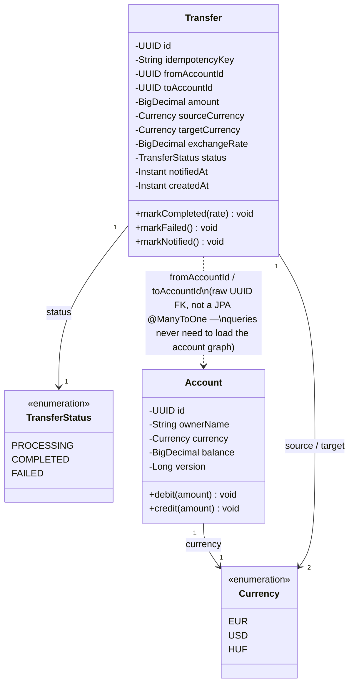
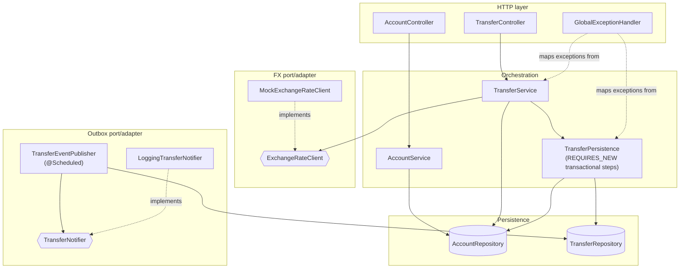
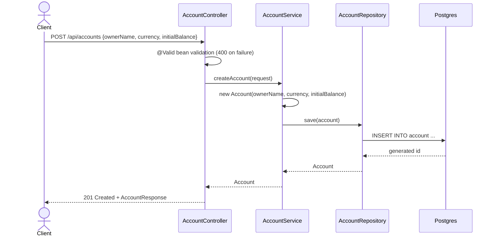
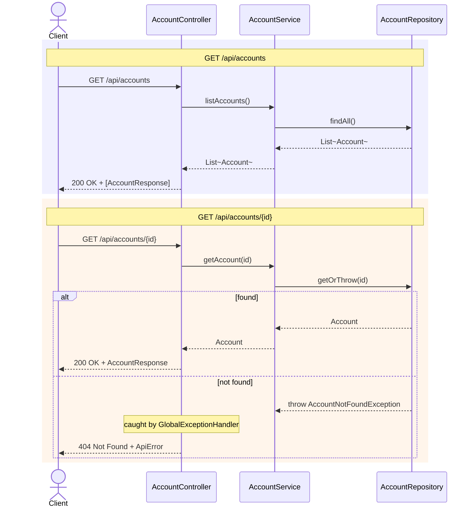
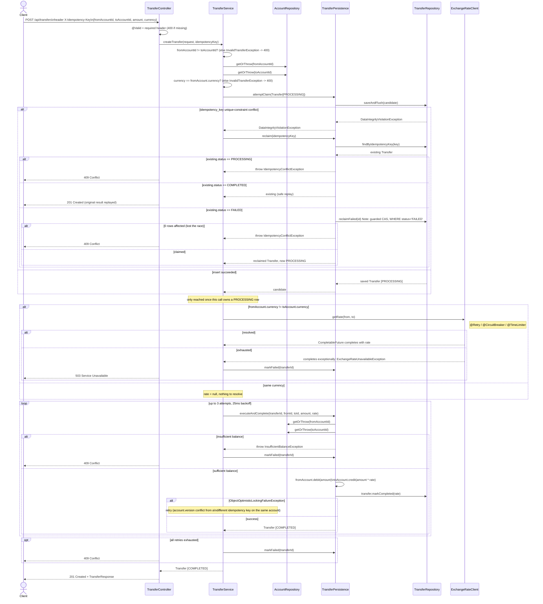
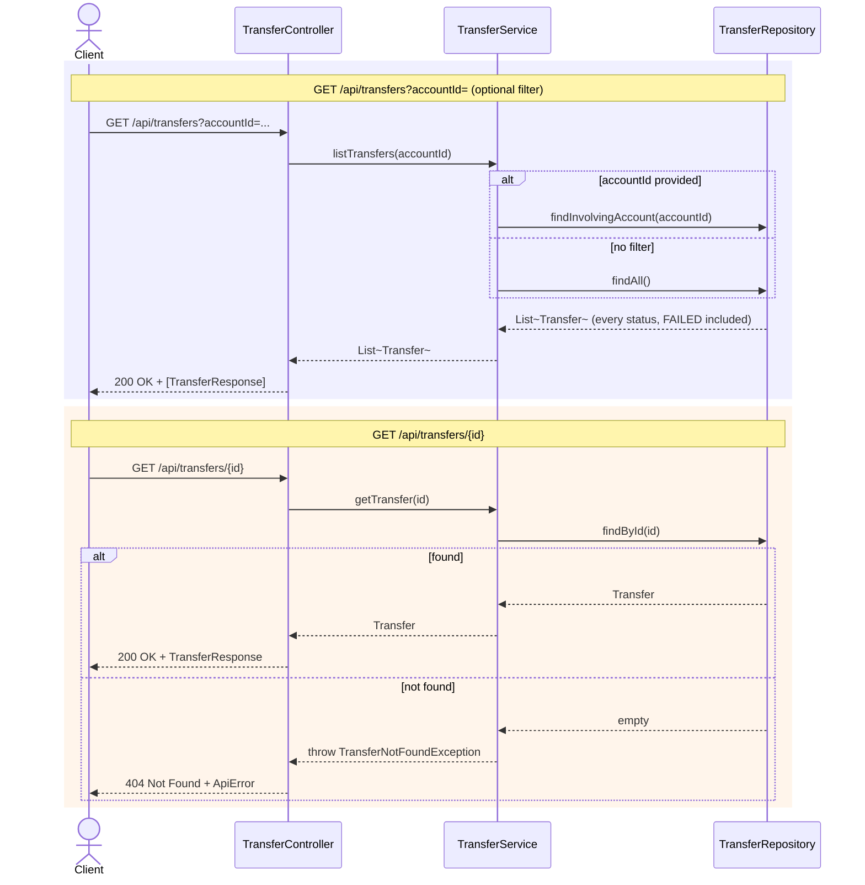
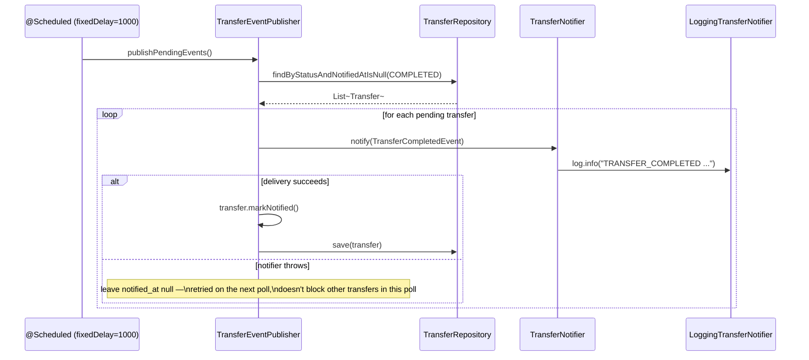

# API flow diagrams

UML diagrams for the implemented endpoints — a class diagram for the domain model, a component
view of how the beans fit together, and a sequence diagram per endpoint. These render natively
on GitHub; no external tooling needed. Cross-referenced from `README.md` §3 (API contract).

---

## Domain model

`Transfer` doubles as both the idempotency record and the outbox row (`idempotencyKey` +
`status`, `notifiedAt`) rather than three separate tables — see `DECISION-LOG.md` #7.

---

## Component view

How the beans collaborate. `TransferPersistence` is deliberately a separate bean from
`TransferService` — see its class-level javadoc for why (Spring's self-invocation limitation on
`@Transactional`).

---

## `POST /api/accounts`

## `GET /api/accounts` & `GET /api/accounts/{id}`

## `POST /api/transfers`

The real complexity lives here: idempotency claim/reclaim, FX resolution, and the
optimistic-lock retry loop, exactly as implemented (not simplified) — server README §4/§5/§6.

## `GET /api/transfers` & `GET /api/transfers/{id}`

## Bonus: the outbox publisher (not an HTTP endpoint, but completes the system-integration requirement)

